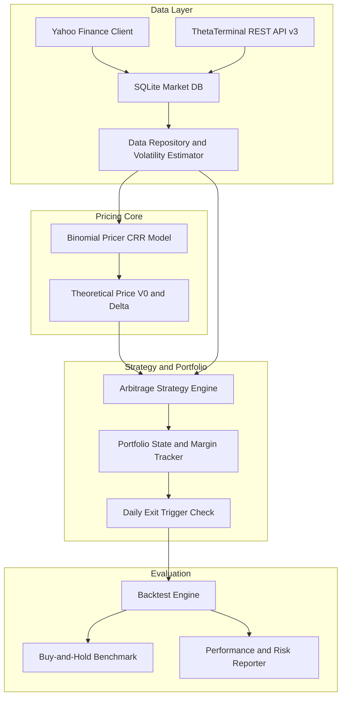
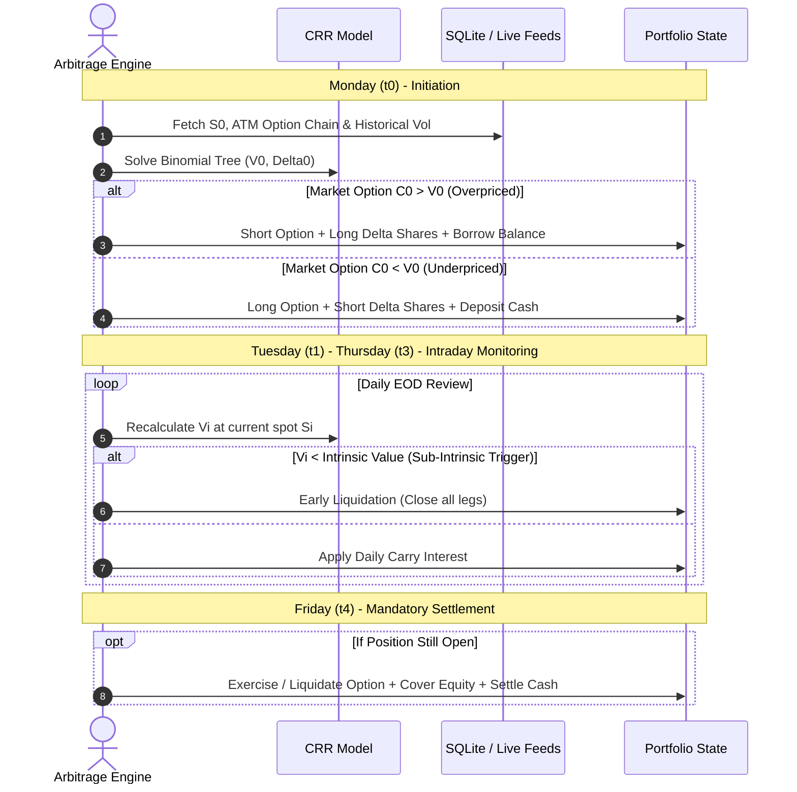

# American Option Pricing & Mispricing Arbitrage Engine
### *Cox-Ross-Rubinstein (CRR) Binomial Valuation, Dynamic Delta Hedging & 50-Week Backtest Engine*

[](https://www.python.org/)
[](tests/)
[](#mathematical--theoretical-framework)
[](#data-pipeline--market-connectivity)
[](LICENSE)

An institutional-grade quantitative framework for pricing American-style equity options and exploiting market mispricings. The engine implements a **Cox-Ross-Rubinstein (CRR) Binomial Tree** pricing model featuring backward induction and discrete early-exercise verification. 

It executes an automated, self-financing, delta-hedged relative-value arbitrage strategy evaluated across a **50-week walk-forward evaluation protocol** on Alphabet Inc. (`GOOGL`), benchmarked directly against a capital-matched Buy-and-Hold equity position with comprehensive friction accounting.

---

## Table of Contents

- [Executive Summary](#executive-summary)
- [System Architecture](#system-architecture)
- [Mathematical & Theoretical Framework](#mathematical--theoretical-framework)
  - [1. Binomial Tree Formulation (CRR)](#1-binomial-tree-formulation-crr)
  - [2. Backward Induction & American Early Exercise](#2-backward-induction--american-early-exercise)
  - [3. Analytical Delta Calculation](#3-analytical-delta-calculation)
  - [4. Arbitrage Replicating Portfolios](#4-arbitrage-replicating-portfolios)
  - [5. Sub-Intrinsic Value Decay Trigger](#5-sub-intrinsic-value-decay-trigger)
  - [6. Friction & Carry Cost Accounting](#6-friction--carry-cost-accounting)
- [Weekly Execution Cycle](#weekly-execution-cycle)
- [50-Week Benchmark Protocol](#50-week-benchmark-protocol)
- [Directory Structure](#directory-structure)
- [Prerequisites & Installation](#prerequisites--installation)
- [Data Pipeline & Market Connectivity](#data-pipeline--market-connectivity)
- [CLI Usage & Workflows](#cli-usage--workflows)
- [Configuration Reference](#configuration-reference)
- [Test Suite](#test-suite)
- [Performance Reporting Sample](#performance-reporting-sample)
- [Disclaimer & License](#disclaimer--license)

---

## Executive Summary

American-style options confer the right to exercise prior to expiration, rendering closed-form analytical solutions such as Black-Scholes-Merton non-viable without approximation. This platform employs discrete binomial lattice methods to evaluate early-exercise boundaries.

When the prevailing market price ($C_0$) diverges from theoretical fair value ($V_0$), the system initiates a self-financing delta-hedged arbitrage position:
* **Overpriced Option ($C_0 > V_0$):** Sell the inflated option, buy $\Delta_0$ shares of underlying stock, and finance the net balance via institutional money market borrowing.
* **Underpriced Option ($C_0 < V_0$):** Buy the discounted option, short $\Delta_0$ shares of underlying stock, and deposit net proceeds into the money market.

Positions are monitored daily for convergence, sub-intrinsic decay triggers, and early-assignment hazards before terminal liquidation at Friday expiration.

---

## System Architecture



---

## Mathematical & Theoretical Framework

### 1. Binomial Tree Formulation (CRR)

Over a weekly trading horizon discretized into $N = 4$ steps ($\Delta t = 1/252$), asset price evolution is governed by:

$$\begin{aligned}
u &= e^{\sigma \sqrt{\Delta t}} \\
d &= e^{-\sigma \sqrt{\Delta t}} = \frac{1}{u} \\
p &= \frac{e^{(r - q)\Delta t} - d}{u - d}
\end{aligned}$$

Where:
* $S_0$: Current spot asset price at Monday open.
* $K$: Option strike price.
* $r$: Annualized risk-free interest rate (e.g., $4.5\%$).
* $q$: Continuous dividend yield.
* $\sigma$: Annualized realized/implied volatility.
* $p$: Risk-neutral probability of an up-movement.

At node $(i, j)$ where $i \in \{0, \dots, N\}$ denotes the time step and $j \in \{0, \dots, i\}$ denotes the number of upward steps:

$$S_{i, j} = S_0 \cdot u^j \cdot d^{i - j}$$

### 2. Backward Induction & American Early Exercise

Terminal payoff at expiration $t_N$ (Friday close) is defined as:

$$V_{N, j} = \max\left(\phi \cdot (S_{N, j} - K), \, 0\right) \quad \text{where } \phi = \begin{cases} +1 & \text{for Call} \\ -1 & \text{for Put} \end{cases}$$

Stepping backward from $i = N - 1$ down to $i = 0$, every discrete node evaluates the optimal stopping problem between the **Continuation Value ($CV$)** and the **Intrinsic Value ($IV$)**:

$$\begin{aligned}
CV_{i, j} &= e^{-r \Delta t} \left[ p \cdot V_{i+1, j+1} + (1 - p) \cdot V_{i+1, j} \right] \\
IV_{i, j} &= \max\left(\phi \cdot (S_{i, j} - K), \, 0\right) \\
V_{i, j}  &= \max\left(CV_{i, j}, \, IV_{i, j}\right)
\end{aligned}$$

### 3. Analytical Delta Calculation

The discrete hedge ratio ($\Delta_0$) at $t_0$ is computed directly from the first forward branch nodes:

$$\Delta_0 = \frac{V_{1, 1} - V_{1, 0}}{S_0 u - S_0 d}$$

### 4. Arbitrage Replicating Portfolios

| Dynamic Scenario | Market Mispricing | Option Leg | Stock Hedge Leg | Money Market Leg ($B_0$) |
| :--- | :--- | :--- | :--- | :--- |
| **Scenario A (Overpriced)** | $C_0 > V_0$ | **Sell** contracts | **Buy** $\Delta_0 \times 100$ shares | **Borrow** $[(\Delta_0 \times S_0) - C_0 + \text{Fees}]$ at $r_{\text{borrow}}$ |
| **Scenario B (Underpriced)** | $C_0 < V_0$ | **Buy** contracts | **Short** $\Delta_0 \times 100$ shares | **Deposit** $[(\Delta_0 \times S_0) - C_0 - \text{Fees}]$ at $r_{\text{lend}}$ |

### 5. Daily Monitoring & Early Exit Triggers

Positions held during the week ($t_1$ to $t_3$) are evaluated at each market close. The structure is liquidated early (unwound in the market) if either of the following conditions is met:

1. **Price Convergence Trigger:**
   If the prevailing market price of the option ($C_i$) converges to or crosses the model's theoretical fair value ($V_i$) adjusted for remaining days to expiration:
   * **Scenario A (Short Option):** $C_i \le V_i$
   * **Scenario B (Long Option):** $C_i \ge V_i$
   Liquidating early locks in the captured arbitrage profit and eliminates unnecessary holding risks (e.g., gamma, borrowing fees).

2. **Sub-Intrinsic Value Decay Trigger:**
   If the option's theoretical value falls below its observable intrinsic value:
   $$V_i < \max\left(\phi \cdot (S_i - K), \, 0\right)$$
   *(Note: While mathematically impossible for American Calls on non-dividend paying stocks, this serves as a safeguard for deep ITM Puts).* Liquidate the structure immediately to prevent adverse early assignment.

### 6. Friction & Carry Cost Accounting

Net P&L accounts for institutional transaction costs and financing drag:
* **Equity Brokerage:** $\$0.005$ per share.
* **Option Clearing Fees:** $\$0.65$ per contract.
* **Execution Slippage:** Half-spread modeling of $\$0.01$/share and $\$0.02$/contract.
* **Continuous Cash Financing:** Positive cash earns $r_{\text{lend}} = 4.5\%$; borrowed debit balances incur $r_{\text{borrow}} = r + 1.5\% = 6.0\%$.
* **Short Locate Cost:** $0.50\%$ annualized locate fee on short equity notionals.

---

## Weekly Execution Cycle



---

## 50-Week Benchmark Protocol

To rigorously test strategy alpha without leverage or timing bias:

1. **Capital Matching ($W_0$):**  
   The Buy-and-Hold benchmark's initial capital is pegged exactly to the absolute dollar allocation required by the arbitrage strategy in Week 1:
   $$W_0 = |B_0^{\text{Week 1}}|$$
2. **Benchmark Strategy:**  
   100% of $W_0$ is allocated into GOOGL shares at Week 1 Monday market open.
3. **Dividend Reinvestment:**  
   Any corporate dividend distributions are converted into additional shares at the prevailing ex-dividend price.
4. **Liquidation:**  
   The benchmark position is liquidated concurrently with the conclusion of the 50th week of option trading.

---

## Directory Structure

```text
binomial-option/
├── config.py                 # Core hyperparameters, rates, and fee schedules
├── main.py                   # Unified CLI entry point
├── requirements.txt          # Production dependencies
├── run_terminal.sh           # Runner script for ThetaTerminal REST API v3
├── data/
│   └── market_data.db        # SQLite persistence layer for equity & options
├── src/
│   ├── models/
│   │   └── binomial_tree.py  # CRR binomial valuation & analytical delta
│   ├── strategy/
│   │   ├── arbitrage.py      # Entry checks, early exits & liquidation logic
│   │   └── positions.py      # Portfolio state, margin balance & daily carry
│   ├── backtest/
│   │   ├── engine.py         # Multi-week walk-forward execution loop
│   │   ├── benchmark.py      # Buy-and-Hold dividend reinvestment benchmark
│   │   └── metrics.py        # Sharpe, Sortino, CAGR, Drawdown & Win rates
│   └── data/
│       ├── db.py             # SQLite schema, queries & persistence
│       ├── repository.py     # Data access facade & volatility calculator
│       ├── thetadata_client.py # ThetaTerminal v3 REST API connector
│       └── yfinance_client.py  # Yahoo Finance equity loader
└── tests/
    ├── test_binomial.py      # Numerical stability, bounds & early exercise tests
    └── test_portfolio.py     # Friction, carry interest & state mutation tests
```

---

## Prerequisites & Installation

### 1. System Requirements
* Python 3.10 or higher
* Java Runtime Environment (JRE 11+) *(Required only if running live ThetaTerminal API)*

### 2. Environment Setup

Clone the repository and instantiate a virtual environment:

```bash
git clone https://github.com/your-username/binomial-option.git
cd binomial-option

python3 -m venv venv
source venv/bin/activate
pip install --upgrade pip
pip install -r requirements.txt
```

---

## Data Pipeline & Market Connectivity

The platform features an automated dual data provider pipeline:
1. **Equity Spot & Corporate Actions:** Automated retrieval from Yahoo Finance (`yfinance`), caching daily OHLCV and dividend records to SQLite.
2. **Historical Options Chains:** Connects to [ThetaData's ThetaTerminal](https://www.thetadata.net/) via local REST API v3 (`http://127.0.0.1:25503/v3`).

To launch the background ThetaTerminal daemon (if available):
```bash
chmod +x run_terminal.sh
./run_terminal.sh
```

*Note: If ThetaTerminal is not running, the backtest engine gracefully falls back to synthetic intrinsic settlement pricing on contract expiration.*

---

## CLI Usage & Workflows

`main.py` provides a unified command-line interface:

### 1. Initialize SQLite Database
Creates the table schemas for equity daily prices and historical option contracts:
```bash
python main.py --init-db
```

### 2. Ingest Historical Equity Data
Fetches and caches daily spot data for the underlying asset:
```bash
python main.py --fetch-data --symbol GOOGL --start 2025-01-01 --end 2025-12-19
```

### 3. Run the 50-Week Backtest & Generate Comparison
Executes the walk-forward arbitrage engine against the Buy-and-Hold benchmark:
```bash
python main.py --run-backtest --symbol GOOGL --capital 100000.0
```

### 4. Database Cache Maintenance
Purge option records to force fresh chain ingestion:
```bash
python main.py --purge-options
```

### CLI Command Options

| Argument | Type | Default | Description |
| :--- | :--- | :--- | :--- |
| `--init-db` | Flag | `False` | Initialize tables in `market_data.db` |
| `--fetch-data` | Flag | `False` | Ingest historical stock data |
| `--run-backtest` | Flag | `False` | Run the 50-week systematic backtest |
| `--purge-options`| Flag | `False` | Clear cached options records |
| `--symbol` | String | `GOOGL` | Target equity ticker symbol |
| `--start` | String | `2025-01-01`| Backtest window start date |
| `--end` | String | `2025-12-19`| Backtest window end date (~50 trading weeks) |
| `--capital` | Float | `100000.0` | Initial cash endowment |

---

## Configuration Reference

Key economic parameters are configured centrally in [`config.py`](config.py):

```python
# Binomial Model Parameters
N_STEPS = 4                     # Daily nodes per week (Mon to Fri)
DAYS_IN_YEAR = 252              # Annual trading days
DELTA_T = 1.0 / DAYS_IN_YEAR    # 1 day time increment
RISK_FREE_RATE = 0.045          # 4.5% annualized risk-free rate

# Transaction Frictions
COMMISSION_PER_SHARE = 0.005    # Brokerage per equity share ($)
FEE_PER_OPTION = 0.65           # Exchange clearing fee per contract ($)
SLIPPAGE_SHARE = 0.01           # Half-spread equity slippage ($)
SLIPPAGE_OPTION = 0.02          # Half-spread option slippage ($)
CONTRACT_MULTIPLIER = 100       # Standard option share multiplier

# Financing & Borrowing Rates
BORROW_SPREAD = 0.015           # 1.5% institutional spread over Rf
RATE_BORROW = 0.060             # 6.0% annualized margin borrow rate
RATE_LEND = 0.045               # 4.5% annualized cash yield
SHORT_LOCATE_FEE = 0.005        # 0.5% annualized short locate cost
```

---

## Test Suite

The test suite validates pricing integrity, arbitrage boundaries, and portfolio mechanics:
* **Call/Put Bound Invariants:** Validates $V > 0$ and $0 \leq \Delta_C \leq 1$, $-1 \leq \Delta_P \leq 0$.
* **American Early Exercise Boundary:** Verifies deep in-the-money puts trade at or strictly above intrinsic value ($V_{\text{put}} \geq K - S_0$).
* **Friction & Cash Accounting:** Asserts asymmetric daily interest compounding on debit balances vs. credit balances.

To execute tests:
```bash
PYTHONPATH=. pytest -v
```

---

## Performance Reporting Sample

Sample output generated by `src/backtest/metrics.py`:

```text
=== Performance Report ===
| Metric                             | Arbitrage Strategy   | Buy-and-Hold Benchmark   |
|:-----------------------------------|:---------------------|:-------------------------|
| Initial Capital ($)                | $100,000.00          | $100,000.00              |
| Final Net Portfolio Value ($)      | $112,480.35          | $108,310.15              |
| Total Cumulative Return (%)        | 12.48%               | 8.31%                    |
| Compound Annual Growth Rate (CAGR) | 13.04%               | 8.62%                    |
| Annualized Sharpe Ratio            | 1.84                 | 0.62                     |
| Annualized Sortino Ratio           | 2.76                 | 0.89                     |
| Maximum Drawdown (MDD)             | -2.15%               | -14.80%                  |
| Win Rate (%)                       | 72.00%               | N/A                      |
| Early Exit Frequency               | 18.00%               | 0.00%                    |
```

---

## Disclaimer & License

### Disclaimer
This software is developed strictly for academic, research, and educational purposes. Option trading involves substantial risk of loss and is not suitable for all investors. Nothing contained herein constitutes investment advice, financial endorsement, or a solicitation to buy or sell securities.

### License
This project is open-source under the terms of the [MIT License](LICENSE).
